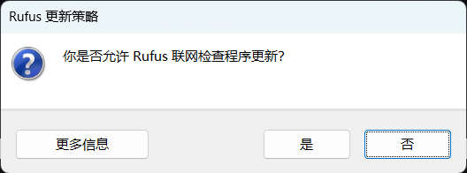
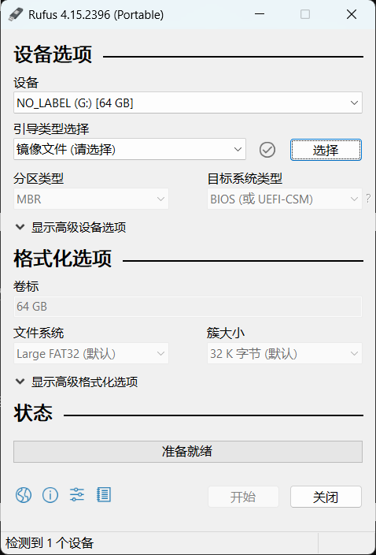
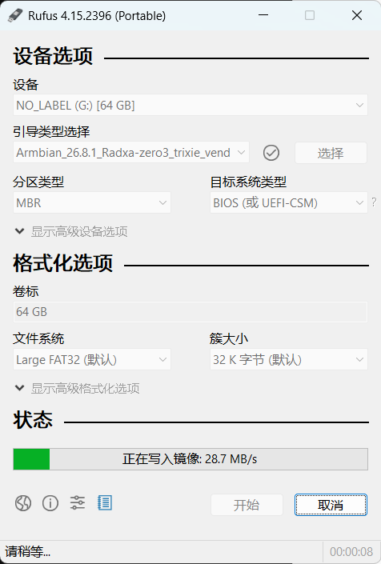
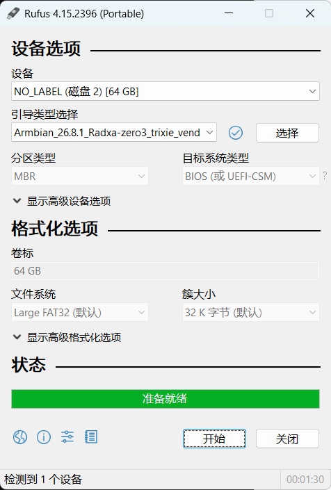

# 不打 HAT · 用 ¥70 的模块飞线替代

**简体中文**

> 官方 HAT 是 4 层板、双面贴装、110 个器件 —— 打样贴片一次上千块，**很多人觉得划不来**。
> 这份就是替代方案：一个降压模块 + 一个半双工转接板，剩下的飞线。**功能上只少了板载音频和关机检测信号。**

先看 [硬件入门](硬件入门.md) 知道 HAT 本来干什么，再看这份知道怎么不用它。

[](不打HAT-接线图.html)

> **图的源文件是 [`不打HAT-接线图.html`](不打HAT-接线图.html)** —— 内联 SVG，下载后浏览器打开，能缩放、能选字、能打印 A3。
> 换模块、换脚位直接改它。上面这张 PNG 只是 GitHub 里的预览。

**目标**：主控从电池取电、经转接板跟舵机总线通信、ToF 挂上 I²C —— **不打 HAT 板**，¥70 的模块顶替上千块的打样。

> ⚠️ **这一章是计划，还没做过。** 接线部分来自规格书和官方原理图，软件部分来自官方 `setup-board.sh` 的源码。
> 做的时候哪步不对就改这里。做完把「没做过、要验证的」那节清掉。

## 要买什么

淘宝链接会失效，**搜索词和要看的数不会**。每行按「搜索词」搜，按「买之前看」挑。找到合适的把链接贴到 [电控采购清单](电控采购清单.md) 里。

| 东西 | 搜索词 | 买之前看 | 约价 |
|---|---|---|---|
| **降压模块** | 「UBEC 5V 3A 2S」 | **输入下限 ≤ 6 V**（很多标 2–6S 的实际 7 V 起，2S 快没电先掉出稳压）· 输出 ≥ 2 A 连续 · 同步降压，**别买 LM2596** | ¥10–15 |
| **半双工转接板** | 「串口总线舵机驱动板 ST SC」 | TTL 版或 USB 版都行。**逻辑供电范围含 3.3 V**（有的只吃 5 V，那就不能接主控）· 舵机侧电源能过 8.4 V。**已有 FE-URT-2 的话它就是 USB 版，可先不买**（见第 4 步） | ¥22 |
| 2×20 排针 | 「树莓派 彩色排针 2x20」 | 2.54 mm · 立式 · 彩色的好数脚 | ¥1 |
| 高耐久 microSD ×2 | 「SanDisk 高耐久 64G」或「海康 PLUS 64G」 | **京东自营** · 标 High Endurance / 监控专用 · **不是** Ultra / EVO 那种普通卡 | ¥90×2 |
| 读卡器 | 「USB3.0 读卡器 TF」 | USB 3.0 | ¥15 |
| 硅胶线 | 「18AWG 硅胶线 红黑」 | 18 或 20 AWG · 硅胶皮（软，耐温）· 红黑各 1 m | ¥10 |
| 保险丝座 + 管 | 「5x20 保险丝座 带线」+「5A 保险丝 5x20」 | 座子带线的省焊 · 快熔 5 A | ¥5 |
| 电源开关 | 「船型开关 KCD1」 | 额定 ≥ 6 A · 单刀单掷就行 | ¥3 |
| PH2.0 3P 端子线 ×5 | 「PH2.0 3P 端子线 单头」 | 2.0 mm 间距 · 3 针 · 单头带线（另一头裸线） | ¥5 |
| 杜邦线 | 「杜邦线 母对母 20cm」 | 母对母 · 20 cm · 一排 40 根 | ¥5 |
| 470 µF 电解 | 「470uF 16V 电解电容」 | 16 V 或以上 · 105 ℃ | ¥1 |
| *（可选）USB 声卡* | 「USB 声卡 免驱 3.5mm」 | **免驱**（Linux 认 UAC 标准）· 带麦克风口 | ¥15 |
| *（可选）小喇叭* | 「3W 4欧 小喇叭」 | 4 Ω 3 W · 接声卡的 3.5 mm 口要经功放，或直接买带功放的 USB 小音箱 | ¥5 |

不打 HAT 会失去：**关机检测信号**（LM5050-1 IO_06）、板载 BMI088（官方软件本就不用）、**板载音频** —— 音频可以用 USB 声卡补回来，见第 8 步。
没有关机信号 + microSD = 硬断电伤卡，**先软件关机再断电**。

## 第 1 步 · 主控点亮，什么都别接

> ⚠️ **2024-11 以后买的 Zero 3W 是 V1.12 版（WiFi 模组 AIC8800），Armbian 官方镜像直接烧是起不来的**：
> 灯双闪、永远进不了系统、局域网里找不到。原因是 Armbian 给这块板配的主线 U-Boot（内存初始化固件是 2024-01 的 v1.21）
> 带不起新板，换成瑞莎自家的引导程序就好。瑞莎官方系统能起、Armbian 起不来，就是这个。
> 我们花了两天、烧了九次卡才定位到，见[踩坑记录](../踩坑记录.md)。下面的做卡脚本已经把这一步和其它坑一起处理了。

**镜像**：Armbian **26.2.1 · Debian 13 (trixie) · minimal · vendor 内核 6.1.115**，Pollen 官方文档指定的版本。
国内镜像站现在只剩 26.8.1，26.2.1 在这（376 MB）：

```
https://fi.mirror.armbian.de/archive/radxa-zero3/archive/Armbian_26.2.1_Radxa-zero3_trixie_vendor_6.1.115_minimal.img.xz
```

别选 `current_6.18`（主线内核，官方运行时不认），别选桌面版。

**1a · 做卡**（把 WiFi、密码、引导程序、串口全打进镜像，烧完插上就能 ssh）

仓库 [`tools/radxa/`](../tools/radxa/) 三个文件复制到本地任一目录，电脑上要有 WSL2（没有就管理员 PowerShell 跑 `wsl --install`，重启一次）：

1. 记事本打开 `card.conf`，改 WiFi 名和密码。用户名密码默认 `duck` / `duck1234`。国内要装官方软件的话，`HTTP_PROXY=` 填电脑上代理的地址（比如 Clash 开「允许局域网」，填 `http://电脑IP:7890`）。
2. 右键 `1-做卡.ps1` → 「使用 PowerShell 运行」，选下载的 `.img.xz`。它在 WSL 里解压、换引导、写配置，一分钟出一个 `xxx-鸭子卡.img`（2.2 GB）。
3. 排针先焊好：先焊对角两针，翻过来看立直了没，再焊其余 38 个。

**1b · 烧卡**（Rufus 便携版，2 MB 不用装）

1. [rufus.ie](https://rufus.ie/zh/) 下 `rufus-x.xxp.exe`。读卡器插电脑，**只插这一个 U 盘类设备**，双击 Rufus。问要不要联网查更新，点**否**：

   

2. 「设备」会自动选中读卡器。点「**选择**」，挑上面生成的 `xxx-鸭子卡.img`：

   

3. 「**开始**」，弹「卡上数据将被清除」点确定，写入约 2 分钟：

   

4. 状态栏回到「准备就绪」就完了，关掉 Rufus，拔卡。**中间 Windows 会弹好几次「是否格式化磁盘」，全部点取消**，它不认 Linux 分区，正常。

   

**1c · 开机、找 IP、ssh**

卡插 Radxa，5V 充电头（苹果 20W 那种就行，别用华为快充头）插 **`5V IN / USB_OTG` 口**（板子背面丝印，靠 TF 卡槽那头）。
等 2 到 3 分钟，它自己连 WiFi。看灯：**双闪几秒 → 双闪两分钟 → 常亮** 就是起来了；一直双闪不变，就是没起来。
路由器后台找一台叫 `radxa-zero3` 的设备拿 IP，Windows 自带 ssh：

```
ssh duck@那个IP        # 密码就是 card.conf 里那个
```

**多一条命：这根 USB 线同时是串口。** 把板子的 `5V IN` 口插到电脑 USB 口（电脑给它供电），设备管理器里会多一个「USB 串行设备 (COMx)」，
串口终端 115200 打开就是登录提示，root 密码在 `card.conf`。WiFi 连不上、ssh 进不去，都从这儿进去看。

点亮了、能 ssh 了再往下。**点不亮的问题别跟接线的问题混在一起。**

## 第 2 步 · 让 `/dev/ttyS2` 出现

做卡脚本已经开好了：extlinux 里挂了 `uart2-m0` overlay，内核控制台放在 tty1，`serial-getty@ttyS2` 和 `ttyFIQ0` 都 mask 掉了。ssh 进去确认一下：

```bash
ls -l /dev/ttyS2            # 有
sudo fuser -v /dev/ttyS2    # 没人占
cat /proc/cmdline           # 里面没有 console=ttyS2 / ttyFIQ0
```

官方 `setup-board.sh` 会去改 `/boot/armbianEnv.txt` 的 `overlay_prefix` / `overlays` / `console`，在这张卡上不生效（瑞莎 U-Boot 走 extlinux，不读 boot.scr），
但它自己的检查项都能过，照跑不误。**`apt upgrade` 升级了内核包的话 extlinux.conf 里的文件名要跟着改**，升级前先看 `/boot/extlinux/extlinux.conf`。

## 第 3 步 · 电源，每接一段量一次

```
NP-F550 ──► 开关 ──► 保险丝 5A ──┬──► 降压模块 ──► 5 V ──► Radxa pin 2（或 4）
                                 │        │
                                 │        └── 输入端并 470 µF
                                 │
                                 └──► 舵机总线 VDD（原压，18 AWG）
共地：电池负极 · 降压输出地 · Radxa pin 6 · 舵机总线 GND
```

```
1  接开关、保险丝，量：开关闭合时保险丝两端应导通
2  接降压模块，先别接 Radxa，量输出：5.0 V ±0.2，极性对
3  ⚠️ 确认极性再插 Radxa —— pin 2/4 是无保护的，接反烧板
4  Radxa 拔掉 USB-C，靠 pin 2 的 5 V 点亮，ssh 能进
5  再接舵机总线的 VDD
```

## 第 4 步 · 舵机总线接主控

```
Radxa 40 针                     转接板 MCU 侧
pin 1   3.3 V    ──────────►   VCC       ⚠️ 只能 3.3 V，接 5 V 它的 TX 会打坏主控 RX
pin 8   UART2_TX ──────────►   RX        ← 交叉
pin 10  UART2_RX ◄──────────   TX        ← 交叉
pin 6   GND      ──────────►   GND

转接板舵机侧
DATA  ──► 舵机总线 S
V     ◄── 舵机总线 VDD（电池原压，第 3 步接的）
G     ──► 共地
```

**USB 版转接板**：不用接 pin 1/8/10，插 Radxa 的 USB 口，串口变成 `/dev/ttyUSB0` 或 `/dev/ttyACM0`，
之后 `robotd.toml` 里 `port` 改成那个。省事，但第 2 步的 uart2-m0 overlay 就用不上了（agetty 照样 mask，无害）。

> 💡 **飞特 FE-URT-2 调试板就是 USB 版转接板** —— 配完 ID 直接挪到机器人上：USB-C 插 Radxa host 口，TTL 口 S 接总线，G 接总线地。
> **电池原压直接给舵机总线，不进 URT-2 的 V1 端子** —— V1 可能跟 USB 5 V 直通，灌 7.4 V 会反灌进 Radxa。
> 板上拨码是信号电平（3.3 / 5 V），拨 5 V。转接板可以先不买。
> 先验 Radxa 认不认 CH343：`dmesg | tail` 看有没有 `ttyACM0`；没有的话 WCH 官网有 Linux 驱动源码。
> 它是唯一的调试板，装进去就不能在电脑上配舵机了 —— **15 颗 ID 全配完再挪**。

**总线怎么分支** —— 头、左腿、右腿在躯干分三路。半双工单线总线是**并联**不是链，星形树形都通，菊花链只是走线方便：

```
转接板 TTL ──┬──► 头颈   30 → 31 → 32 → 33 → 34
             ├──► 左腿   20 → 21 → 22 → 23 → 24
             └──► 右腿   10 → 11 → 12 → 13 → 14
             （imu_to_dxl 200 挂躯干里任一路）
```

分法：URT-2 自带两个 TTL 口各出一路、第三路从舵机再分；或买「舵机总线分线板 3P」一进四出（¥5）；或三根线并焊。
**V 和 G 用 18 AWG 单独走到三个支路**，S 随便走。⚠️ **别把三路电流全走 `imu_to_dxl` 板** —— 它四个座子虽是并联，但 2 层板直通铜皮没按几安培设计，会烧。它挂一路的末端或中间。

## 第 5 步 · 一颗舵机验证通信

只挂**一颗**配好 ID 的舵机（比如左膝 23），主控上：

```bash
# 官方运行时带的总线基准工具（第 7 步装完才有），或先用 Python 快速 ping：
pip install feetech-servo-sdk    # 或 scservo_sdk
# 1 Mbps，ping ID 23 —— 回了就通了
```

不通按顺序查：`ls /dev/ttyS2` 有没有 → `fuser` 有没有人占 → TX/RX 是不是交叉 → 转接板 VCC 是不是 3.3 V → S 线接触。

## 第 6 步 · ToF

```
VL53L8CX          Radxa 40 针
SDA      ◄──►    pin 3
SCL      ◄──►    pin 5
3V3      ◄───    pin 17     （pin 1 给转接板了，分开用）
GND      ────►   pin 6
```

pin 3/5 板载带上拉，不用外加。

⚠️ **I²C 还要一个 overlay。** 官方是 `i2c3` 重 mux 到 M0（就是 pin 3/5），代价是失去 USB-C PD 协商。
官方的 overlay 在 `deploy/audio/i2c3-pihat.dts`，是给 HAT 写的，**不打 HAT 能不能直接用，待验证**。

## 第 7 步 · 跑官方运行时

```bash
curl -fsSL https://raw.githubusercontent.com/pollen-robotics/microduck/main/scripts/provision.sh -o /tmp/provision.sh
sudo sh /tmp/provision.sh
# = setup-board.sh → migrate-network.sh → 重启 → install.sh，全自动
robotctl health
```

`robotd.toml` 在 `/etc/robot/`，串口默认 `/dev/ttyS2`，USB 版转接板改成 `/dev/ttyUSB0`。

## 第 8 步 · 想要声音（可选）

不打 HAT 就没有 codec，官方的叫声、摸头识别、ToF 电子琴、多鸭合唱都用不了 —— **但机器人走路不受影响**，官方注释原话「没有 codec 的板子走路完全一样，只是不出声」。

想要回来，插个 **USB 声卡**（免驱那种，Linux 直接认）：

```bash
aplay -l                          # 看到 USB Audio 那张卡的名字，比如 card 1: Device
sudo nano /etc/robot/robotd.toml
```

```toml
[audio]
enabled = true
device = "plughw:CARD=Device"     # 换成 aplay -l 看到的名字，官方默认是 plughw:aic3104
```

```bash
sudo systemctl restart robotd
```

喇叭接声卡的 3.5 mm 口（小喇叭要功放，直接买带功放的 USB 小音箱最省事），麦克风接声卡的 mic 口。

⚠️ **没验证过**：官方 `sounds` 和 `pet_detect` 是按 aic3104 的采样率和通道数写的，USB 声卡不一定对得上。跑通了把这条改掉。

## 没做过、要验证的

| 项 | 疑问 | 怎么验 |
|---|---|---|
| 第三方转接板 @ 1 Mbps | 官方 HAT 的方向电路是 `1G08+1G125+1G126`，¥22 的板子方向切换够不够快 | 第 5 步通了、`bench_dynamixel_bus` 错误计数为 0 |
| `i2c3-pihat.dts` 不打 HAT 能不能用 | 那个 overlay 是给 HAT 写的 | 第 6 步 `i2cdetect -y 3` 看到 0x29 |
| 降压模块扛不扛得住舵机启动压降 | 15 颗同时动电池会跌 | 走路时主控不重启；不行就加大输入电容 |
| Armbian 具体哪个镜像 | 官方说 26.2.x，没说 minimal 还是 desktop | 第 1 步能 ssh 进去就行 |
| USB 声卡能不能替代 aic3104 | 官方音频代码按 codec 的采样率写的 | 第 8 步 `robotctl health` 音频那行不报错、开机有叫声 |

接线图见文首，源文件是同目录的 `不打HAT-接线图.html`。

