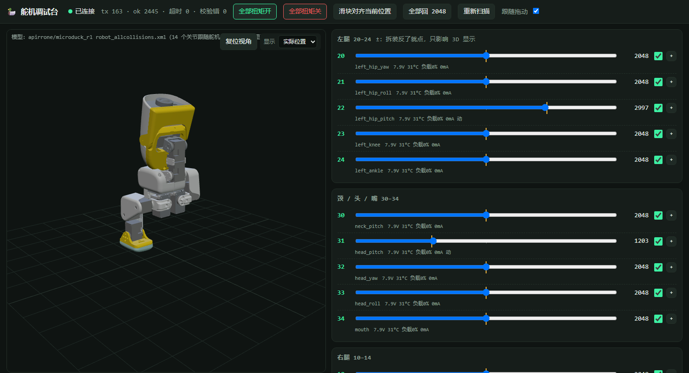

# servo-web · 飞特舵机网页调试台

接上串口，浏览器里拖滑块让舵机动，3D 鸭子跟着转。给装机、校零、台架验收用，也是[飞特适配架构](../../software/飞特适配架构.md)台架清单 0–8 项的工具。



- 15 个滑块按左腿 / 头颈 / 右腿分组，黄线是舵机实际位置，每颗有扭矩开关
- 实时回读：位置、电压、温度、负载、电流、状态位（过流 / 过热 / 过载会标红）
- 3D 模型跟着实际位置动（用的是 [microduck_rl](https://github.com/apirrone/microduck_rl) 的 MuJoCo 模型，Apache-2.0）；每颗关节旁的 ± 按钮翻转显示方向，只影响 3D 不动舵机
- 姿态：把当前实际位置存成一个姿态，一键发回去；带 `steps` 的 JSON 是序列（自带「站起来」三步）。所有姿态 / 站姿 / 零位都按「过渡时间」从当前位置线性插过去，随时点「停」
- 单颗操作：导出 0–90 全部寄存器（JSON / Markdown 表，做**寄存器底账**用）、重启 0x08、中位校准、改 ID、写任意寄存器（可选解锁落盘 EEPROM）
- `sync_read` 时序测试：15 颗一次读 200 遍，报 min / avg / p99 / max 和失败数
- 后端不依赖飞特 SDK，[`feetech.py`](feetech.py) 直接按 2026 版协议手册发包（[`docs/飞特资料/`](../../docs/飞特资料/)），一百多行

## 跑起来

```bash
pip install -r requirements.txt
python server.py --port COM5                 # Windows + URT-2，串口号看设备管理器
python server.py --port /dev/ttyUSB0         # 板子上，URT-2 插板子的 USB 口
python server.py --port /dev/ttyS2           # 板子上走 40 脚的 UART2（要先接半双工转接，见下）
python server.py --fake                      # 没舵机，只看界面
```

浏览器开 `http://127.0.0.1:8080`；在板子上跑就用板子 IP，手机也能开。默认管的 ID 是 `20-24,30-34,10-14`，别的用 `--ids`。3D 模型的文件在 `model/`，已经生成好；要重新生成：

```bash
python build_model.py --src <microduck_rl>/src/mjlab_microduck/robot/microduck
```

## 注意

- **URT-2 先插 USB，再给舵机上电。** 反了总线电平会卡在 2.1 V，扫描一颗都没有、只有广播能收到几个 0，见[踩坑记录](../../踩坑记录.md#工具)。
- **板子上用 ttyS2 前先 `sudo systemctl stop robotd`**。官方守护进程每秒都在开这个口找舵机，两边一起发会撞包。用 URT-2 走 ttyUSB0 没这个问题。
- **ttyS2 直接飞线到舵机是收不到应答的**。瑞莎的 UART 是全双工 3.3 V 两根线，飞特总线是单线半双工，中间要么三态缓冲（官方 HAT 的做法），要么拆一块 URT-2 的芯片方案。转接板做好以后先用页面上的时序测试看有没有回显：有回显会表现为全部"无应答"。
- 中位校准和改 ID 写 EEPROM，页面会弹确认。改 ID 时总线上只接那一颗。
- "全部回 2048" 对扭矩开着的舵机是立刻执行的，装在腿上的先关扭矩或者一颗一颗来。
- 页面从 jsdelivr 加载 three.js，开页面的电脑要能上网；后端本身不需要。
- 嘴（ID 34）模型里没有这个关节，滑块能动舵机，3D 不显示。

## 文件

| 文件 | 干什么 |
|---|---|
| `server.py` | HTTP + WebSocket 服务，starlette + uvicorn |
| `feetech.py` | 飞特协议：PING / READ / WRITE / SYNC_READ / SYNC_WRITE / REBOOT，寄存器名表 |
| `index.html` | 单文件前端，three.js 从 CDN 来 |
| `build_model.py` | MuJoCo XML + STL → `model/model.json` + `model/meshes.bin`（顶点 int16 量化，21 MB 变 2.9 MB） |
| `model/` | 生成好的模型，14 个关节 |
